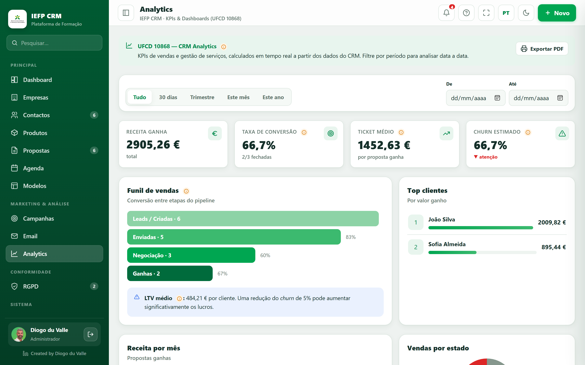

# Analytics

O módulo de **KPIs & Dashboards** — o foco da UFCD **10868**. Tudo respeita o **filtro temporal** e permite **comparar com o período anterior**.

*Funil de vendas, conversão, ticket médio, churn e top clientes (UFCD 10868).*

## Filtro e comparação

- **Filtro temporal** no topo: Tudo / 30 dias / Trimestre / Este mês / Este ano / datas De–Até.
- Botão **Comparar** — calcula o período anterior de igual duração e mostra **▲▼ X% vs anterior** em cada KPI (o churn aparece invertido).

## Os indicadores — um a um

- **Funil de vendas** — conversão entre etapas do pipeline (ou propostas criadas no período).
- **Taxa de conversão** — % de propostas que chegam a *Ganha*.
- **Ticket médio** — valor médio das propostas ganhas.
- **Churn** — perda de clientes (menor é melhor).
- **Receita por mês** — barras das propostas ganhas no período.
- **Vendas por estado** — distribuição por estado do pipeline.
- **Top clientes** — por valor ganho.
- **Análise de perdas** — agrupa os **motivos de perda** das propostas perdidas (barras + maior causa).
- **CAC** — Custo de Aquisição de Cliente = **orçamento de marketing ÷ novos clientes**. Defines o orçamento no campo próprio (**Aplicar**).
- **LTV / CAC** — rácio entre o valor do cliente e o custo de o adquirir; fica **verde quando ≥ 3:1** (saudável).
- **Lead scoring** — pontuação **0–100** de cada contacto (compras, *engagement*, loyalty, segmento) → **Quente / Morno / Frio**, com barras.
- **Insights de IA** *(simulado)* — cartões com leituras automáticas dos KPIs e sugestões.

## Exportar

Botão **Imprimir relatório** (no callout) → gera um PDF com **KPIs** (e comparação, se ativa), **funil** e **top clientes**, respeitando o período.

!!! tip "Balões pedagógicos"
    Vários indicadores têm o ícone **ⓘ** com a definição do conceito e a página dos slides (conversão, ticket, churn, funil, LTV, CAC, lead scoring).

!!! note "Dashboard vs Analytics"
    O **Dashboard** dá a visão rápida do dia; o **Analytics** é a análise aprofundada com comparações e exportação.
