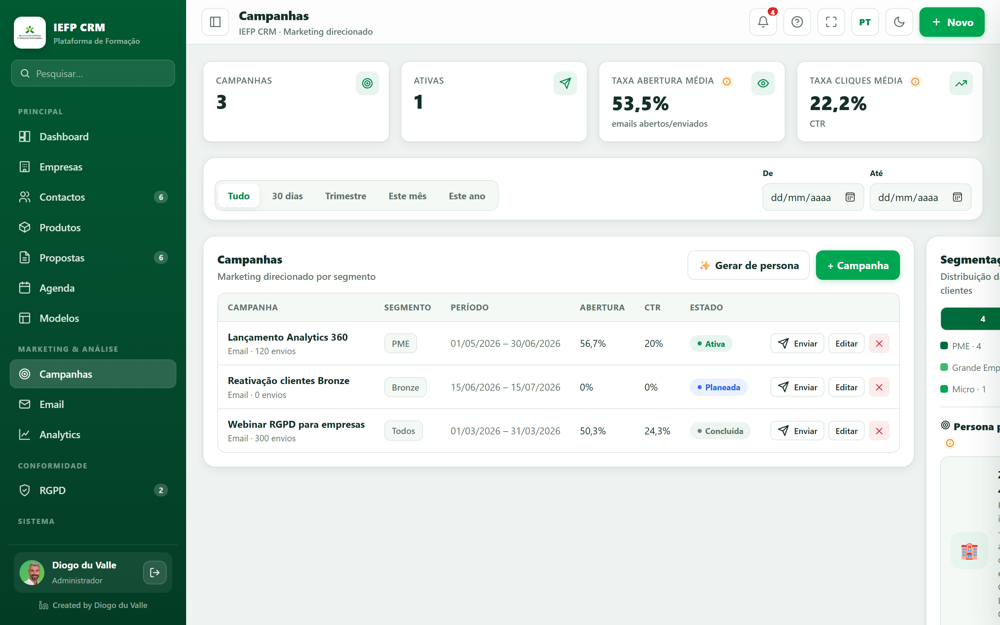

# Campaigns & Email

*Campaign planning and email communication.*

Two menus: **Campaigns** (marketing planning) and **Email/Communication** (sending and follow-up).

---

## Campaigns

### The screen
Date filter + list of campaigns (name, channel, segment, status, metrics) + **+ Campaign** and **✨ Generate from persona**.

### Create — field by field
- **Name**, **Channel** (Email / SMS / Social Media).
- Target **segment** (All / Micro / SME / Large Enterprise).
- **Status** (Planned / Active…), **Start** and **End**.
- Associated email **template**.

### Persona generator (✨)
1. Click **Generate from persona**.
2. Choose a **persona** (e.g.: Zé Miguel — hotelier; Sofia — sales director; António — shopkeeper).
3. Set the **Objective** (Acquisition/Retention/Reactivation/Launch) and **Channel**.
4. The app shows the **estimated audience** in the segment and a **suggested message** → **Generate**.

### Send
**Send** dispatches to the contacts in the segment and records the sends in the **History** (with source "Campaign").

---

## Email / Communication

### Tabs
- **Send history** — rich table; click a send to view the preview and resend.
- **Templates** — email templates.
- **Automations** — automatic rules.
- **Scheduled** — queue of future sends.

### Composer (Email module)
- **Customer** — by **search** (not a giant dropdown).
- **Template** — pre-fills subject + message.
- **CC / BCC**, **Subject**, **Message** (textarea).
- **Live preview** + **mode chip** (real/simulated).
- **Suggest with AI** *(simulated)* — generates a personalized draft.
- The user's **signature** is automatically added at the end.

### Email templates — field by field
Name, subject, color, show logo, greeting, body, button text/link, signature. Uses **tags** (`{{cliente.nome}}`, `{{entidade.nome}}`).

### Automations (marketing automation)
**Trigger → email** rules:

- **Trigger:** new customer / proposal created / proposal sent / proposal won.
- **Segment condition** (All / Micro / SME / Large).
- **Steps** in sequence, each with a **delay (days)** → they go to **Scheduled**.
- **Active/Inactive** toggle + trigger counter.

### Metrics
**Open** and **click** rate per send and aggregated.

!!! warning "Real vs simulated sending · tracking"
    **Trainees** always send in **simulated** mode (safe). The open/click metrics in the learning environment are **simulated** — the app explains that real tracking requires a pixel + server.

## Related

-   <svg class="icon" viewBox="0 0 24 24"><circle cx="9" cy="7" r="4"/><path d="M3 21v-2a4 4 0 0 1 4-4h4a4 4 0 0 1 4 4v2M16 3.1A4 4 0 0 1 16 11M21 21v-2a4 4 0 0 0-3-3.8"/></svg> __Contacts__

    ---
    The customer base you will segment in campaigns.

    [:octicons-arrow-right-24: Open](empresas-contactos.md)

-   <svg class="icon" viewBox="0 0 24 24"><path d="M3 3v18h18"/><path d="M7 15l4-5 3 3 5-7"/></svg> __Analytics__

    ---
    Measure the impact of campaigns (opens, clicks, conversion).

    [:octicons-arrow-right-24: Open](analytics.md)

