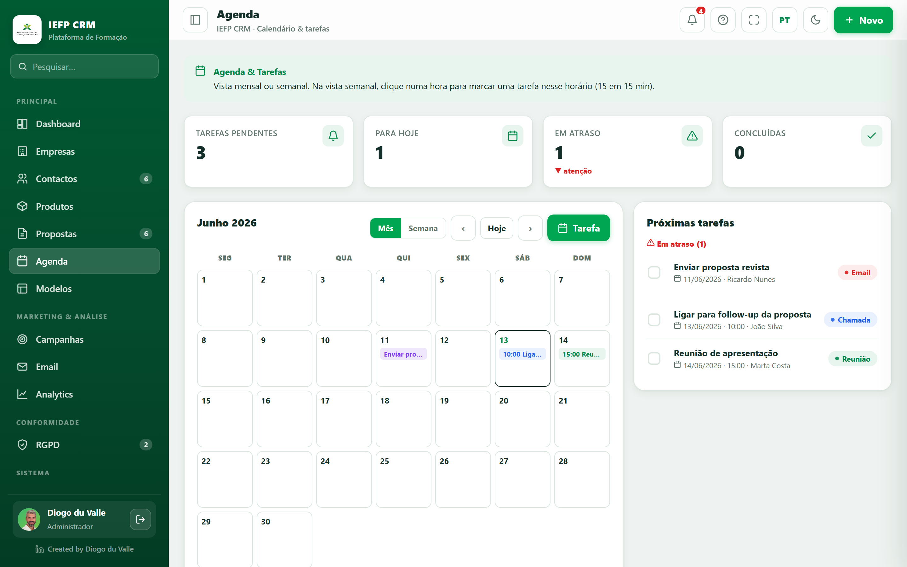

# Dashboard & Calendar

<video class="iefp-video" controls preload="metadata" playsinline poster="/manual/assets/screens/dashboard.png"><source src="/manual/assets/videos/dashboard-en.webm" type="video/webm"><source src="/manual/assets/videos/dashboard-en.mp4" type="video/mp4"><track kind="subtitles" src="/manual/assets/videos/dashboard-en.vtt" srclang="en" label="English" default></video>

*Overview: period KPIs, recent proposals and pipeline by status.*

## Dashboard

The first page after you log in - the **business overview**. Everything respects the **date filter** at the top (All / 30 days / Quarter / This month / This year / dates).

### The first line: what needs doing today

Under the title, the app says what is waiting:

> **Diogo**, today you have **1 overdue task**, **1 task for today**, **3 cases past SLA** and **2 overdue GDPR requests**.

Every number is a **link** to the right place. Anything past its deadline is underlined in **amber** - it stands apart from what can still be done today. With nothing pending it says *"nothing urgent today - a good day to prospect"*.

!!! tip "Why this replaced the app description"
    There used to be a sentence explaining what the CRM is. You read it once.

    A dashboard that only **describes** is a poster; one that **points** is a starting line. The description did not disappear - it just got smaller, underneath.

### What it shows
- **KPIs** for the period: revenue won, average ticket, pipeline, new customers.
    - With **comparison** enabled, each KPI shows **▲▼ X% vs previous period**.
    - Financial values may appear with 🔒 depending on the role.
- **Won revenue per month** - bar chart (only *Won* proposals), with the **reading** underneath: *"Best month: April, with €8,236.08. August has no revenue recorded yet, and 6 days are left."* The chart shows; the sentence concludes - which is what UFCD 10868 asks for. With a single month it does not appear: there is no comparison to make.
- **Where leads come from** - a donut of companies by acquisition channel, with a shortcut to **ROI by channel** in Analytics, where the real analysis lives (conversion and value generated per channel).
- **Pipeline by status** - distribution of proposals (donut/bars).
- **Recent proposals** - latest activity; click to open.
- **Learning shortcuts** - quick access to Companies, Calendar, Email, etc.
- **Target for the month** - won revenue for the month against the **target**, with a bar and a projection *"at the current pace it closes at X"*. If there are **individual quotas**, it shows yours and everyone else's. You set it in **[Settings → Sales targets](definicoes.md#sales-targets)**; with no target, the card explains that instead of showing a number on its own.

!!! tip "Notifications"
    The **bell** at the top gathers warnings: proposals about to expire (≤15 days), overdue GDPR requests, overdue tasks. Clicking takes you to the item.

---

## Calendar

*The Calendar: monthly/weekly schedule and tasks linked to clients.*

Calendar and **tasks** associated with customers.

### Views
- **Month** - monthly grid; today is highlighted; each day shows the task chips (up to 3 + “more”).
- **Week** - hour axis (8am-8pm), Google Calendar style; tasks with a time appear as positioned blocks.
- **‹ ›** and **Today** buttons to navigate (move back/forward 7 days in the week view).

!!! note "Switching view keeps you in the same place"
    Until August 2026, moving three months forward in **Month** and clicking **Week** sent you back to this week: there were two independent cursors that never spoke to each other.

    The two views are now the **same journey**. Month to Week stays in the month you are looking at (in the current month it opens on this week; in any other, on that month's first week). Week to Month goes to the month the week belongs to.

    A week can fall across two months, so the rule is the same in both directions: **a week belongs to the month of its Thursday** (ISO 8601). And the title says so when that happens: *"30 Oct - 5 Nov 2026"*.

### Create a task - field by field
Click a **day** (month view) or an **hour** (week view) - the date/time are filled in for you. Fields:

- **Title** *required*.
- **Type** - Call / Meeting / Follow-up / Email / Other (each type has a color). Picking **Other** opens the box to say **which** - and that is what shows on the list badge (*"Site visit"*, not *"Other"*). See [the "Other" rule](empresas-contactos.md#other-always-asks-which).
- **Date** and **Time**.
- **Duration** - 15 / 30 / 45 / 60 / 90 / 120 min.
- **Customer** associated.
- **Status** (Pending / Done) and **Notes**.

### Task notes
In the side list (**Upcoming tasks**), tasks that **have notes** show a **document icon** on the right. Click it to **read the note** without opening the whole record - handy for checking what was agreed just before a call or a meeting.

### Manage
- **Complete/reopen** a task via the *checkbox* (it gets struck through).
- **Today's** or **overdue** tasks enter the **Alerts** (bell).

!!! tip "Asking instead of looking"
    **[Pulso](assistente.md)** answers *"what do I have today"* and *"do I have overdue tasks"* from any module, without coming to the Calendar.

!!! note "Products & Catalog"
    The **[Products](produtos.md)** menu organizes the catalog (Family → Subfamily → Item) that feeds the proposal lines.
