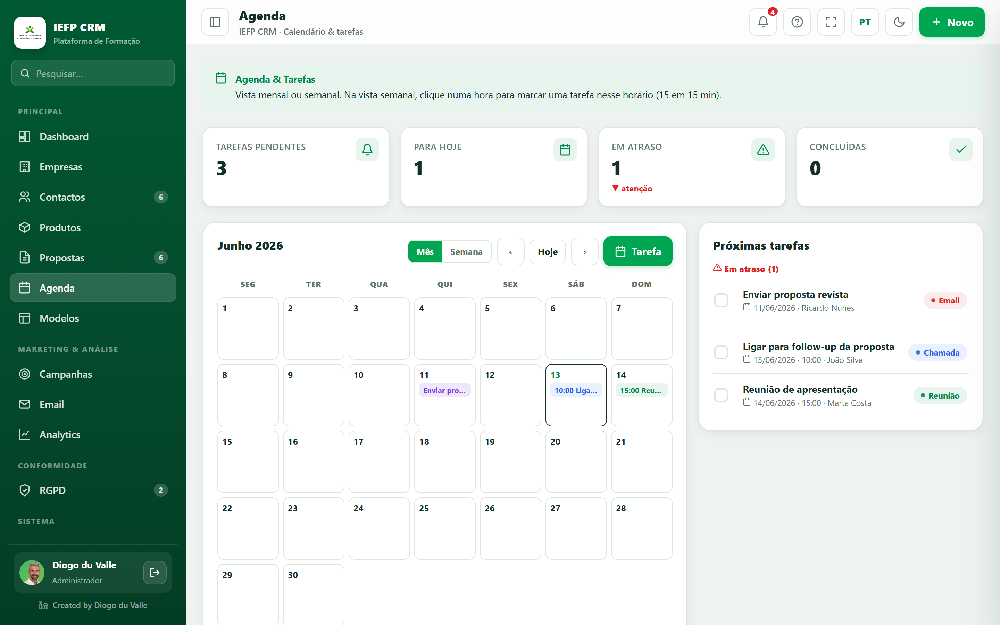

# Dashboard & Agenda

<video class="iefp-video" controls preload="metadata" playsinline poster="/manual/assets/screens/dashboard.png"><source src="/manual/assets/videos/dashboard-pt.webm" type="video/webm"><source src="/manual/assets/videos/dashboard-pt.mp4" type="video/mp4"><track kind="subtitles" src="/manual/assets/videos/dashboard-pt.vtt" srclang="pt" label="Português" default></video>

*Vista geral: KPIs do período, propostas recentes e pipeline por estado.*

## Dashboard

A primeira página depois de entrares — a **visão geral** do negócio. Tudo respeita o **filtro temporal** no topo (Tudo / 30 dias / Trimestre / Este mês / Este ano / datas).

### O que mostra
- **KPIs** do período: receita ganha, ticket médio, pipeline, novos clientes.
    - Com a **comparação** ativa, cada KPI mostra **▲▼ X% vs período anterior**.
    - Valores financeiros podem aparecer com 🔒 conforme o papel.
- **Receita ganha por mês** — gráfico de barras (só propostas *Ganha*).
- **Pipeline por estado** — distribuição das propostas (donut/barras).
- **Propostas recentes** — últimos movimentos; clica para abrir.
- **Atalhos pedagógicos** — acesso rápido a Empresas, Agenda, Email, etc.

!!! tip "Notificações"
    O **sino** no topo junta avisos: propostas a expirar (≤15 dias), pedidos RGPD fora de prazo, tarefas em atraso. Clicar leva ao item.

---

## Agenda

*A Agenda: calendário mensal/semanal e tarefas ligadas a clientes.*

Calendário e **tarefas** associadas a clientes.

### Vistas
- **Mês** — grelha mensal; o dia de hoje está destacado; cada dia mostra os chips das tarefas (até 3 + “mais”).
- **Semana** — eixo de horas (8h–20h), estilo Google Calendar; as tarefas com hora aparecem como blocos posicionados.
- Botões **‹ ›** e **Hoje** para navegar (recuam/avançam 7 dias na vista semana).

### Criar uma tarefa — campo a campo
Clica num **dia** (vista mês) ou numa **hora** (vista semana) — a data/hora entram preenchidas. Campos:

- **Título** *obrigatório*.
- **Tipo** — Chamada / Reunião / Follow-up / Email / Outro (cada tipo tem cor).
- **Data** e **Hora**.
- **Duração** — 15 / 30 / 45 / 60 / 90 / 120 min.
- **Cliente** associado.
- **Estado** (Pendente / Concluída) e **Notas**.

### Gerir
- **Concluir/reabrir** uma tarefa pelo *checkbox* (fica riscada).
- Tarefas de **hoje** ou em **atraso** entram nos **Alertas** (sino).

!!! note "Produtos & Catálogo"
    O menu **[Produtos](produtos.md)** organiza o catálogo (Família → Subfamília → Artigo) que alimenta as linhas das propostas.
