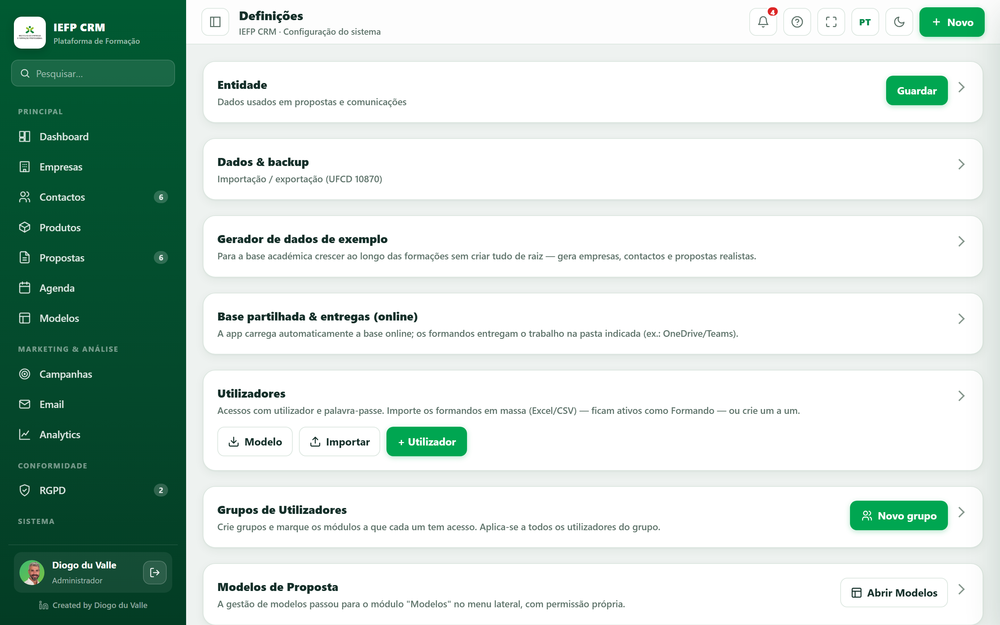

# Definições

*As Definições, com cartões colapsáveis (vários só de administrador).*

A **configuração do sistema** (grupo Sistema). Os cartões são **colapsáveis** — clica no título para abrir/fechar; na primeira visita estão recolhidos para a página ficar compacta. Vários cartões são **só para administradores** (selo *Admin*).

## Cartões disponíveis

### Entidade
Dados usados em propostas e comunicações: **nome da entidade**, **NIF/NIPC**, **telefone**, **email** (é o *reply-to* dos emails), **cidade**, **EPD** (Encarregado de Proteção de Dados).

### Dados & backup
**Exportar** / **Importar** o JSON completo do CRM (backup ou migração). É também aqui que **repões os dados de exemplo**.

### Gerador de dados de exemplo
Cria rapidamente **empresas, contactos e propostas** realistas (PT) — acrescenta aos dados existentes.

### Marca & Aparência *(Admin)*
*White-label*: **nome**, **cor principal** (deriva a paleta), **logótipo**, **fundo do login**. **Aplicar** / **Repor IEFP**. → [Email & Marca](../formador/email-marca.md).

### Envio de email real (EmailJS) *(Admin)*
As **chaves** estão **fixas** (🔒); geres só o **modo** (real/simulado) + **Enviar teste**. → [Email & Marca](../formador/email-marca.md).

### Grupos de Utilizadores *(Admin)*
Matriz **papéis × módulos**: define o que cada grupo vê (Administrador/Formador = tudo; Formando limitado). Inclui a opção **ocultar valores financeiros** por grupo.

### Modelos de Proposta
Atalho para o construtor de modelos. → [Modelos de Proposta](modelos.md).

### Outras referências
**Níveis de loyalty**, **Taxas de IVA** (por região), **Origens de cliente** (lista editável).

## Em modo turma (online)

Numa turma, as Definições ganham dois cartões centrais:

- **Formandos da turma** — gestão de acessos (importar, individual, repor password). → [Gerir a turma](../formador/gerir-turma/index.md).
- **Entrega & validação de trabalhos** — receber e avaliar entregas. → [Entrega & validação](../formador/entregas.md).

!!! note "Quem vê as Definições"
    Os **formandos não acedem** às Definições. É um espaço de **formador/administrador**.
