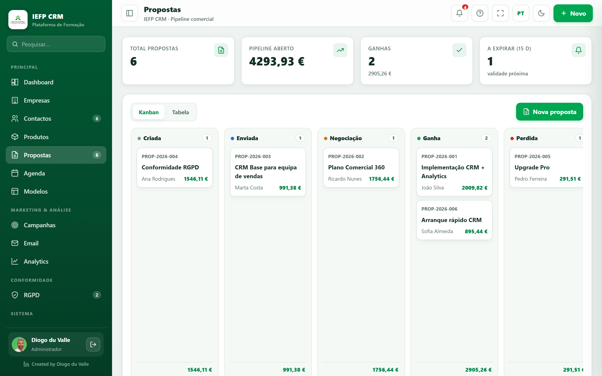

# Guided tutorial: from zero to your first proposal

!!! abstract "In this tutorial"
    **Goal:** create a company, a contact and an item, build a **proposal**, export the **PDF** and **submit it**. · **Duration:** ~12 min · **For:** Trainee (and anyone getting to know the CRM).

## Before you start

- [x] You are **inside your class** (you entered through the `?t=…` link).
- [x] You see the sidebar on the left (Dashboard, Companies, Contacts…).

> If you haven’t entered yet, see **[Getting started — Trainee](../primeiros-passos/formando.md)**.

---

## Step 1 · Create the company

1. In the sidebar, click **Companies**.
2. Click **+ Company**.
3. Fill in **Name** (e.g. *Hotel Sol & Mar, Lda.*) and the **NIPC** (the app validates it).
4. Choose the **Region** (e.g. *Madeira*) — it will set the VAT further on.
5. **Save**.

!!! success "Result"
    The company appears in the list. Click it to see the **360º view** (no contacts yet for now).

!!! note "📷 Screenshot"
    *(Capture `empresas.png` — the company form filled in.)*

---

## Step 2 · Create the contact

1. Click **Contacts** → **+ Contact**.
2. **First name** and **Surname** (e.g. *Ana Costa*).
3. In **Company**, choose the one you created; fill in the **Role**.
4. **Email**, **NIF** (validated) and the **Segment** (e.g. *SME*).
5. Confirm the **Region** (it inherits the VAT logic). **Save**.

!!! tip "Loyalty"
    The **loyalty** level (Bronze/Silver/Gold) adjusts with purchase volume and gives an automatic **discount** on proposals.

---

## Step 3 · Create the item (catalog)

1. Click **Products**.
2. **+ Family** (e.g. *Software*) → **+ Subfamily** (e.g. *Licenses*).
3. **+ Item**: name (*CRM Pro License*), family/subfamily, **price** (e.g. €79) and **VAT**. **Save**.

!!! info "Why the catalog first?"
    In proposals, the lines are chosen **from the catalog** — it ensures consistent prices and VAT.

---

## Step 4 · Build the proposal

1. Click **Proposals** → **+ Proposal**.
2. **Customer:** choose *Ana Costa* → the **loyalty discount** and the **region’s VAT** now apply.
3. **Title:** *CRM licensing proposal*.
4. **Line:** choose the item *CRM Pro License* → description/price/VAT fill in; set **Quantity 5**.
5. Note the **Totals** block (subtotal, discount, VAT, total).
6. **Save**.

!!! warning "VAT notice"
    If the customer’s region doesn’t match the line’s VAT, **“Correct to {region}”** appears — click it to align.

!!! note "📷 Screenshot"
    

---

## Step 5 · Export the PDF

1. Open the proposal → action bar → **Preview** (see the A4 sheet).
2. **Download PDF** → in the print dialog, choose **Save as PDF**.

!!! tip "Document look"
    The layout comes from the **[Proposal Template](../modulos/modelos.md)**. Try switching templates and exporting again.

---

## Step 6 · Move through the pipeline and submit

1. In **Proposals** (Kanban view), **drag** the card to **Negotiation** and then **Won**.
2. Set your **signature** in your profile (bottom-left corner) — it is required to hand in.
3. Click **Submit my work** → confirm and **Submit**.

!!! success "You completed the flow!"
    You created data, a proposal, a PDF and made the submission — the full cycle of a CRM. 🎉

---

## Next

- Go deeper into each screen in **[Features](../modulos/index.md)**.
- Explore **[GDPR](../rgpd/index.md)** (consents, data subject requests).
- See the **[Analytics](../modulos/analytics.md)** with your proposal already counted.
