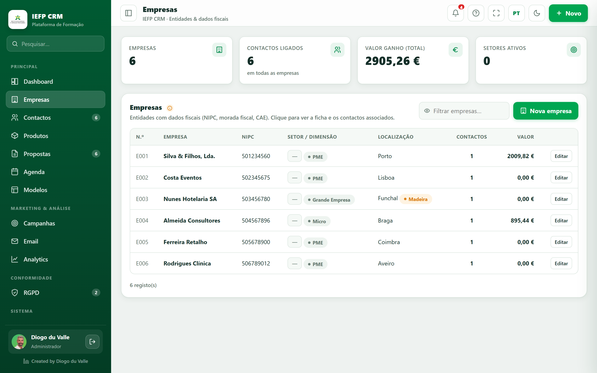

# Tutorial guiado: do zero à primeira proposta

!!! abstract "Neste tutorial"
    **Objetivo:** criar uma empresa, um contacto e um artigo, montar uma **proposta**, exportar o **PDF** e **submetê-la**. · **Duração:** ~12 min · **Para:** Formando (e qualquer pessoa a conhecer o CRM).

## Antes de começar

- [x] Estás **dentro da tua turma** (entraste pelo link `?t=…`).
- [x] Vês a barra lateral à esquerda (Dashboard, Empresas, Contactos…).

> Se ainda não entraste, vê **[Primeiros passos — Formando](../primeiros-passos/formando.md)**.

---

## Passo 1 · Criar a empresa

1. Na barra lateral, clica **Empresas**.
2. Clica **+ Empresa**.
3. Preenche **Nome** (ex.: *Hotel Sol & Mar, Lda.*) e o **NIPC** (a app valida-o).
4. Escolhe a **Região** (ex.: *Madeira*) — vai definir o IVA mais à frente.
5. **Guardar**.

!!! success "Resultado"
    A empresa aparece na lista. Clica nela para veres a **ficha 360º** (por agora sem contactos).

!!! note "📷 Screenshot"
    

---

## Passo 2 · Criar o contacto

1. Clica **Contactos** → **+ Contacto**.
2. **Nome** e **Apelido** (ex.: *Ana Costa*).
3. Em **Empresa**, escolhe a que criaste; preenche o **Cargo**.
4. **Email**, **NIF** (validado) e o **Segmento** (ex.: *PME*).
5. Confirma a **Região** (herda a lógica de IVA). **Guardar**.

!!! tip "Loyalty"
    O nível de **loyalty** (Bronze/Prata/Ouro) ajusta-se com o volume de compras e dá **desconto** automático nas propostas.

---

## Passo 3 · Criar o artigo (catálogo)

1. Clica **Produtos**.
2. **+ Família** (ex.: *Software*) → **+ Subfamília** (ex.: *Licenças*).
3. **+ Artigo**: nome (*Licença CRM Pro*), família/subfamília, **preço** (ex.: 79 €) e **IVA**. **Guardar**.

!!! info "Porquê primeiro o catálogo?"
    Nas propostas, as linhas escolhem-se **do catálogo** — garante preços e IVA consistentes.

---

## Passo 4 · Montar a proposta

1. Clica **Propostas** → **+ Proposta**.
2. **Cliente:** escolhe *Ana Costa* → o **desconto de loyalty** e o **IVA da região** passam a aplicar-se.
3. **Título:** *Proposta de licenciamento CRM*.
4. **Linha:** escolhe o artigo *Licença CRM Pro* → descrição/preço/IVA preenchem-se; põe **Quantidade 5**.
5. Repara no bloco **Totais** (subtotal, desconto, IVA, total).
6. **Guardar**.

!!! warning "Aviso de IVA"
    Se a região do cliente não bater certo com o IVA da linha, aparece **“Corrigir para {região}”** — clica para alinhar.

!!! note "📷 Screenshot"
    

---

## Passo 5 · Exportar o PDF

1. Abre a proposta → barra de ações → **Pré-visualizar** (vê a folha A4).
2. **Descarregar PDF** → na janela de impressão, escolhe **Guardar como PDF**.

!!! tip "Aspeto do documento"
    O layout vem do **[Modelo de Proposta](../modulos/modelos.md)**. Experimenta trocar de modelo e voltar a exportar.

---

## Passo 6 · Mover no pipeline e submeter

1. Em **Propostas** (vista Kanban), **arrasta** o cartão para **Negociação** e depois **Ganha**.
2. Define a tua **assinatura** no perfil (canto inferior esquerdo) — é obrigatória para entregar.
3. Clica **Submeter o meu trabalho** → confirma e **Submeter**.

!!! success "Concluíste o fluxo!"
    Criaste dados, uma proposta, um PDF e fizeste a entrega — o ciclo completo de um CRM. 🎉

---

## A seguir

- Aprofunda cada ecrã em **[Funcionalidades](../modulos/index.md)**.
- Explora o **[RGPD](../rgpd/index.md)** (consentimentos, pedidos de titular).
- Vê os **[Analytics](../modulos/analytics.md)** com a tua proposta já contabilizada.
